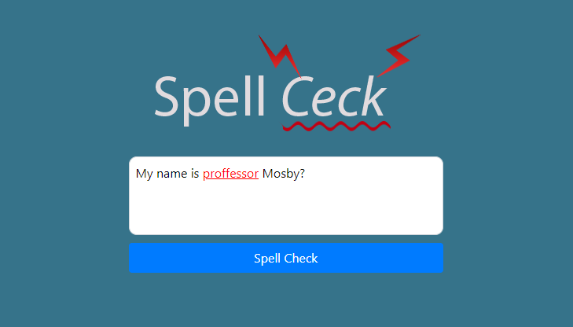

# Spellchecker

### What is it?

A small project that I started to learn Rust. It's just a text box where you input a text and it will return a spellchecked version.

The project is very simple and I am using the [Wagner-Fischer algorithm](https://en.wikipedia.org/wiki/Wagner%E2%80%93Fischer_algorithm) to check every word in the sentence against a limited [dictionary](./dictionary.txt) of words and see the closest match. It can handle basic punctuation but probably is missing a lot of corner cases.

Can be tried online [here](http://spellchecker.lucianmusat.nl/).
**NOTE:** it might not always be online, it's self hosted.
